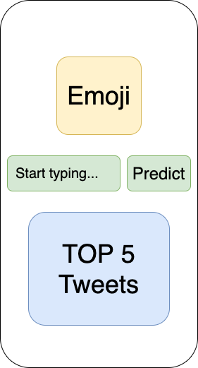
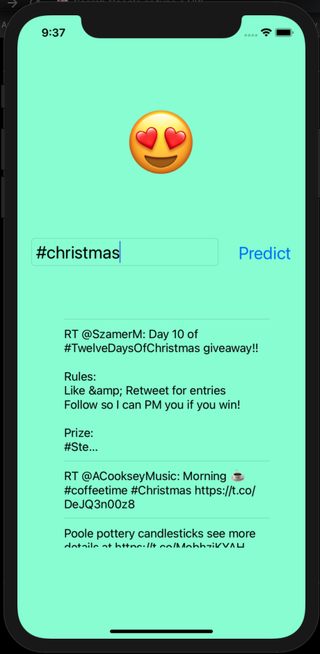
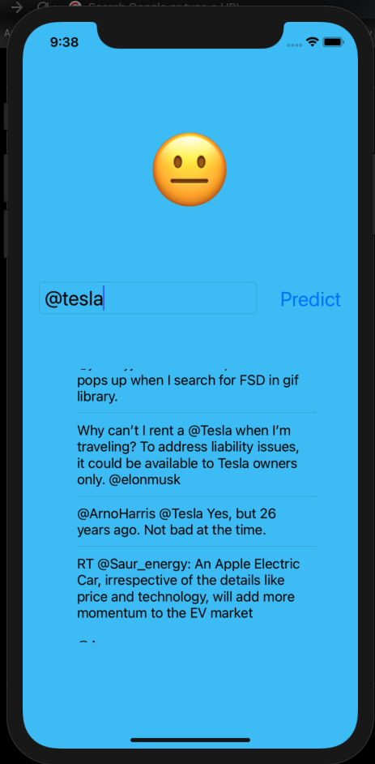
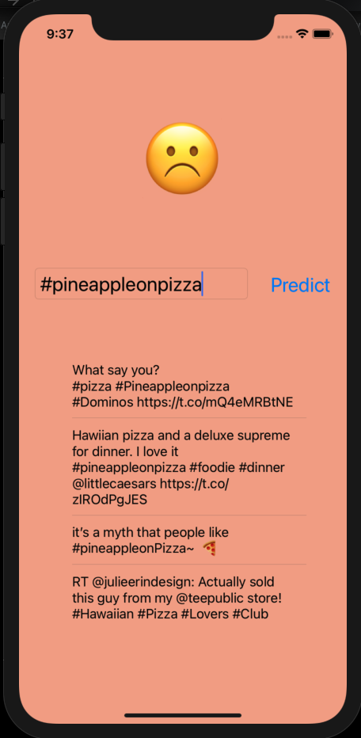

# MeLazy 
I'm not sure why I name this project "MeLazy". The name has nothing to do with the project but I'm just too lazy to change it. 

Have you ever be so bored and wonder "Do people still hate pineapple on pizza ? Or it is soo 2015 ??"
If you do, how would you find out the answer ? 

Normally you would get on Twitter > search for #pineappleOnPizza > Analyze tweet > rank it in 3 diff category ( pos / neg / neutral ).
After doing it for over 100 times, you prolly have a feeling on how people feels about pineapple on pizza. 

Just in case, you don't want to do such work, you can use MeLazy. Melazy can help you answer such question in just couple second. 

# UI
Every simple app. 
User can type search keyword in search box then click on Predit. App will display result in Emoji box, also display 5 tweets.

# Data set
3 datasets with about 1.7M records 
1. twitter-apple-sander-3: contains 988 tweets in a csv format. 
http://boston.lti.cs.cmu.edu/classes/95-865-K/HW/HW3/

2. apple-twitter-sentiment: contains 3000 tweets in a csv format. 
https://data.world/crowdflower/apple-twitter-sentiment

3. sentiment140: 1.6 M tweets in a csv format.
http://help.sentiment140.com/for-students

# Backend
1. Use Spark to clean and merge data
2. Using MlTextClassifier ( NLP ) to build ML model 
3. Swift and StoryBoard to build App

# Accuracy : %70

# Sample
Positive

Neutral

Negative

