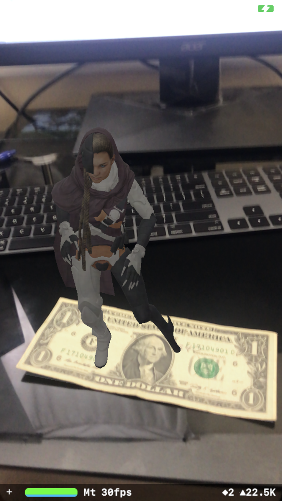
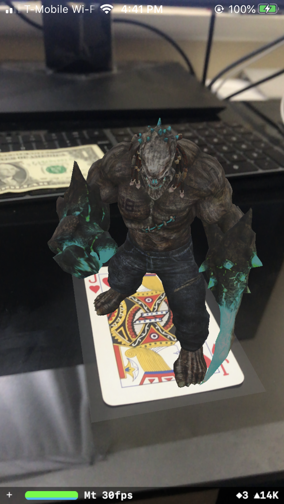
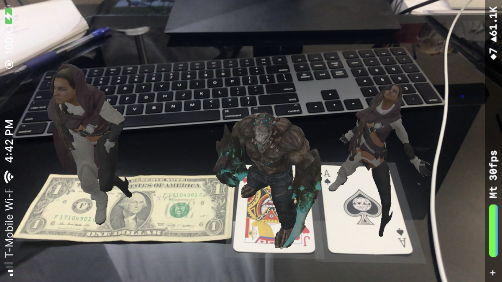

# Poke3D

Poke3D is a simple AR project. If image is detected, a 3D character would be rendered on top.
Compatible with iOs 13.0 +




#
- Using ScenceKit and image detection. 
- 3D characters from: https://www.mixamo.com/
- Blender to convert model

#
Poke3D able to detech 3 items: 
- jack of heart
- ace of spade
- a dollar bill

## 3d Characters
- Taunt on Mutant
- Private on Snake Hip Hop Dance
- Private on Standing Taunt Chest Thump

## Issue
- File looses animated, rig property when convert to .usdz using xocde or usdpython
- Xcode shutdowns immediately after open .dae, usdz files.(Not sure if this is a bug on xcode 11 or something wrong with my laptop.)
- Can't edit 3d character in xcode.

## Work Around:
### IMPORT:
- Export .dae file from Mixamo
- Import into Blender
- From blender export to .gtl file
- Use usdpython (converter python lib from apple) to convert .gtl to .usdz format
  ```
  /Applications/usdpython/usdzconvert/usdzconvert /path/to/file
  ```
- Import to xcode

### EDIT:
- Click on model file 
- Press "Enter" key to rename file, change to whatever
- Press [Command] + [Shift] + S to save as... , name it as original file
- Delete the old file
